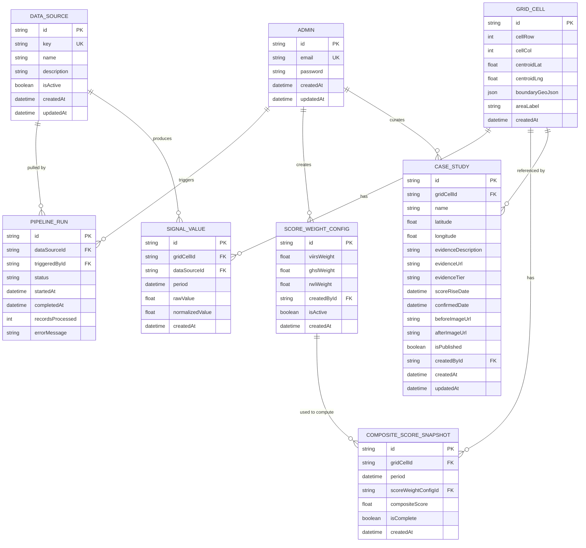

## Project: Shadow Economy Map — Addis Ababa Growth Detection MVP (V1)
**Links back to:** [1. Problem & Solution Statement], [2. Functional & Non-Functional Requirements], [3. Use Cases], [roadmap.md]

This becomes `prisma/schema.prisma` (or equivalent ORM schema) almost line for line.

**Design decisions carried over from discussion (finalized):**
- There are no public user accounts. The map is fully anonymous and public. The only authenticated role in this schema is **Admin** — a single project/data-team login, no customer accounts, no multi-tier permissions. (Public accounts are a V2 item — not part of this schema.)
- There is no forecasting entity anywhere below. This schema stores only **detected/observed** signals and scores for past and current periods. Forecasting is a V5 item, dependent on a currently unavailable ground-truth data partnership — a distinct future schema, not an addition to `CompositeScoreSnapshot`.
- Composite score snapshots are never overwritten in place — each period's score is stored as its own row, so the time-slider (FR-02) can show genuine historical change.
- **GDELT does not contribute to the composite score formula.** GDELT is independent, human-verified event evidence used only for case-study validation — it has no weight in `ScoreWeightConfig` and no numeric role in `CompositeScoreSnapshot`. The composite score is a function of VIIRS, GHSL, and RWI only.
- **Spatial data uses plain types, not PostGIS.** `boundaryGeoJson` is a plain JSON column and coordinates are plain floats — no PostGIS extension for V1. This was a deliberate choice to avoid unnecessary learning-curve risk for a fixed, pre-generated grid at MVP scale. Native PostGIS geometry types are a Grand Vision technical upgrade, not a V1 requirement.
- **Grid cell size is fixed, not dynamic.** V1 uses a single fixed cell size for the whole grid, chosen to match the resolution of the coarsest input source (Meta RWI, ~2.4km). A dynamic/multi-resolution grid (adapting cell size to map zoom level) is a Grand Vision improvement, not a V1 requirement — building it now would be premature engineering effort ahead of proving the core detection claim.

**Remaining open items (finalized in principle, one numeric value and one formula detail still pending):**
- Exact grid cell size in meters — methodology is settled (fixed, matched to RWI resolution); the specific number is a parameter to finalize during pipeline implementation, not an open architectural question.
- Whether `ScoreWeightConfig` weights must sum to 1.0, and whether the formula is a simple weighted sum (current assumption) — enforced at the application layer, not the schema layer, and should be settled before FR-22 is implemented.

---

### 4.1 Entity List

| Entity | Purpose |
|---|---|
| Admin | A project/data-team member with access to the protected admin area |
| DataSource | One of the four external data sources feeding the system (VIIRS, GHSL, Meta RWI, GDELT) |
| PipelineRun | A single attempted data pull/refresh for one data source, logged for observability |
| GridCell | A single spatial cell in the Addis Ababa grid over which signals and scores are computed |
| SignalValue | A single data source's raw and normalized value for one grid cell in one time period |
| ScoreWeightConfig | A versioned set of per-source weights (VIIRS, GHSL, RWI only) used to compute the composite score |
| CompositeScoreSnapshot | The computed composite growth score for one grid cell in one time period, tied to the weight config used to produce it |
| CaseStudy | An admin-curated, independently verified known-growth location shown on the public map, validated in part using GDELT evidence |

---

### 4.2 Entity Detail

#### Admin

| Field | Type | Constraints | Notes |
|---|---|---|---|
| id | String (UUID) | PK, default uuid() | |
| email | String | unique, required | |
| password | String | required | bcrypt hash, never returned in API responses |
| createdAt | DateTime | default now() | |
| updatedAt | DateTime | updatedAt | |

**Relations:**
- `pipelineRuns`: one Admin → many PipelineRun (`triggeredBy`)
- `scoreWeightConfigs`: one Admin → many ScoreWeightConfig (`createdBy`)
- `caseStudies`: one Admin → many CaseStudy (`createdBy`)

No `role` field — only one admin type exists in V1 (no multi-admin permission tiers).

---

#### DataSource

| Field | Type | Constraints | Notes |
|---|---|---|---|
| id | String (UUID) | PK, default uuid() | |
| key | Enum (DataSourceKey) | unique, required | `VIIRS \| GHSL \| RWI \| GDELT` |
| name | String | required | Display name, e.g. "VIIRS Night-Time Lights" |
| description | String | required | Short explanation shown on the methodology page (FR-09) |
| isActive | Boolean | default true | Allows disabling a source without deleting historical data |
| createdAt | DateTime | default now() | |
| updatedAt | DateTime | updatedAt | |

**Relations:**
- `signalValues`: one DataSource → many SignalValue
- `pipelineRuns`: one DataSource → many PipelineRun

Seed data: exactly four rows at launch. GDELT's `SignalValue` rows, if stored at all, are for internal/case-study reference only — GDELT is never referenced by `ScoreWeightConfig`.

---

#### PipelineRun

| Field | Type | Constraints | Notes |
|---|---|---|---|
| id | String (UUID) | PK, default uuid() | |
| dataSourceId | String | FK → DataSource.id, required | |
| triggeredById | String | FK → Admin.id, required | |
| status | Enum (RunStatus) | required, default RUNNING | `RUNNING \| SUCCESS \| FAILED` |
| startedAt | DateTime | default now() | |
| completedAt | DateTime? | nullable | Set when the run finishes (success or failure) |
| recordsProcessed | Int? | nullable | Count of grid cells/records successfully ingested |
| errorMessage | String? | nullable | Populated only on failure |

**Relations:**
- `dataSource`: many PipelineRun → one DataSource
- `triggeredBy`: many PipelineRun → one Admin

Drives FR-19 ("last successful update" timestamp), FR-20 (health status), and FR-24 (run log) — all derived by querying `PipelineRun` rows per `DataSource`, not stored redundantly on `DataSource` itself.

---

#### GridCell

| Field | Type | Constraints | Notes |
|---|---|---|---|
| id | String (UUID) | PK, default uuid() | |
| cellRow | Int | required | Row index within the Addis Ababa grid |
| cellCol | Int | required | Column index within the Addis Ababa grid |
| centroidLat | Float | required | Used for map rendering and case-study proximity checks |
| centroidLng | Float | required | |
| boundaryGeoJson | Json | required | Polygon boundary of the cell (plain JSON, no PostGIS) |
| areaLabel | String? | nullable | Human-readable nearest-area name, shown in the click-to-inspect panel (FR-04) |
| createdAt | DateTime | default now() | |

**Relations:**
- `signalValues`: one GridCell → many SignalValue
- `compositeScoreSnapshots`: one GridCell → many CompositeScoreSnapshot
- `caseStudies`: one GridCell → many CaseStudy (nullable link)

**Constraints:** unique composite on `(cellRow, cellCol)`.

Grid is generated once, at a single fixed resolution matched to RWI's ~2.4km native resolution (exact meters value to be finalized during pipeline implementation).

---

#### SignalValue

| Field | Type | Constraints | Notes |
|---|---|---|---|
| id | String (UUID) | PK, default uuid() | |
| gridCellId | String | FK → GridCell.id, required | |
| dataSourceId | String | FK → DataSource.id, required | |
| period | DateTime | required | Time period this value applies to (e.g., first day of the month) |
| rawValue | Float | required | The source's original value for this cell/period |
| normalizedValue | Float | required | Value scaled to a common 0–1 range |
| createdAt | DateTime | default now() | |

**Relations:**
- `gridCell`: many SignalValue → one GridCell
- `dataSource`: many SignalValue → one DataSource

**Constraints:** unique composite on `(gridCellId, dataSourceId, period)`.

Powers the FR-04 signal-breakdown panel. For VIIRS/GHSL/RWI, these values feed `CompositeScoreSnapshot`. GDELT rows here (if stored) are for reference only and are not read by the composite score computation.

---

#### ScoreWeightConfig

| Field | Type | Constraints | Notes |
|---|---|---|---|
| id | String (UUID) | PK, default uuid() | |
| viirsWeight | Float | required | |
| ghslWeight | Float | required | |
| rwiWeight | Float | required | |
| createdById | String | FK → Admin.id, required | |
| isActive | Boolean | default false | Only one config should be active at a time |
| createdAt | DateTime | default now() | |

**Relations:**
- `createdBy`: many ScoreWeightConfig → one Admin
- `compositeScoreSnapshots`: one ScoreWeightConfig → many CompositeScoreSnapshot

Only 3 weight fields — no `gdeltWeight` (see design decisions above). Weights are versioned (each edit creates a new row) so every `CompositeScoreSnapshot` traces back to the exact formula used, supporting the Reproducibility non-functional requirement.

Open detail to settle before FR-22 is implemented: whether weights must sum to 1.0, and whether the formula is a simple weighted sum (current assumption) — application-layer logic, not a schema question.

---

#### CompositeScoreSnapshot

| Field | Type | Constraints | Notes |
|---|---|---|---|
| id | String (UUID) | PK, default uuid() | |
| gridCellId | String | FK → GridCell.id, required | |
| period | DateTime | required | Same period convention as SignalValue |
| scoreWeightConfigId | String | FK → ScoreWeightConfig.id, required | |
| compositeScore | Float | required | `(viirsWeight × viirs_norm) + (ghslWeight × ghsl_norm) + (rwiWeight × rwi_norm)` |
| isComplete | Boolean | default true | False if VIIRS, GHSL, or RWI data was missing for this cell/period |
| createdAt | DateTime | default now() | |

**Relations:**
- `gridCell`: many CompositeScoreSnapshot → one GridCell
- `scoreWeightConfig`: many CompositeScoreSnapshot → one ScoreWeightConfig

**Constraints:** unique composite on `(gridCellId, period, scoreWeightConfigId)`.

An incomplete snapshot (`isComplete: false`) is still stored, not discarded — the public map visually distinguishes incomplete cells rather than hiding them.

---

#### CaseStudy

| Field | Type | Constraints | Notes |
|---|---|---|---|
| id | String (UUID) | PK, default uuid() | |
| gridCellId | String? | FK → GridCell.id, nullable | Optional cross-link |
| name | String | required | e.g., "CMC growth corridor" |
| latitude | Float | required | |
| longitude | Float | required | |
| evidenceDescription | String | required | Short explanation of the independently verified growth (FR-07) |
| evidenceUrl | String? | nullable | Link to supporting news/report — typically sourced via the tiered evidence process (official announcements → market reports → infrastructure coverage → local news) |
| evidenceTier | Enum (EvidenceTier)? | nullable | `OFFICIAL \| MARKET_REPORT \| INFRASTRUCTURE \| LOCAL_NEWS` — records which tier of the sourcing process this evidence came from, for transparency |
| scoreRiseDate | DateTime | required | Date the composite score began rising for this location |
| confirmedDate | DateTime | required | Date the growth was independently confirmed (news/report date). Application logic should treat `scoreRiseDate <= confirmedDate` as the expected validation pattern |
| beforeImageUrl | String? | nullable | For the before/after comparison (FR-08) |
| afterImageUrl | String? | nullable | |
| isPublished | Boolean | default false | Admin must explicitly publish before it appears on the public map or case studies list page |
| createdById | String | FK → Admin.id, required | |
| createdAt | DateTime | default now() | |
| updatedAt | DateTime | updatedAt | |

**Relations:**
- `gridCell`: many CaseStudy → one GridCell (nullable)
- `createdBy`: many CaseStudy → one Admin

`isPublished` defaults to false: case studies are a factual claim and require deliberate admin action to go live.

---

### 4.3 ER Diagram

---

### 4.4 Indexes & Constraints Beyond the Obvious

| Item | Detail |
|---|---|
| GridCell(cellRow, cellCol) | Unique composite — one cell per grid position |
| SignalValue(gridCellId, dataSourceId, period) | Unique composite — one value per cell/source/period |
| SignalValue(period) | Index — the time-slider (FR-02) queries by period across many cells |
| CompositeScoreSnapshot(gridCellId, period, scoreWeightConfigId) | Unique composite — preserves prior computations under different weight configs |
| CompositeScoreSnapshot(period) | Index — same time-slider access pattern |
| PipelineRun(dataSourceId, startedAt) | Index — supports "most recent run per source" lookups for FR-19/FR-20 |
| ScoreWeightConfig(isActive) | Only one config active at a time; enforced at the application layer |
| CaseStudy(isPublished) | Index — the public map and case studies list page only query published entries |
| No cascade delete: DataSource → SignalValue | `onDelete: Restrict`; disable via `isActive` instead of deleting |
| No cascade delete: GridCell → CompositeScoreSnapshot | `onDelete: Restrict`; historical scores must survive even if the grid is later regenerated |
| No cascade delete: ScoreWeightConfig → CompositeScoreSnapshot | `onDelete: Restrict`; a weight config must never be deletable once snapshots depend on it — deactivate via `isActive` |
| Float for signal/score values | `Float`, not `Decimal` — these are scientific/statistical values, not currency |
| No currency fields anywhere | V1 has no monetary data — no payments, subscriptions, or billing (those are V3+ items) |
| No User/Account table | V1 has no public user accounts — only `Admin`. A `User` entity is introduced in V2, out of scope for this schema |

---

### 4.5 Migration Notes

_(To be filled in as the schema is implemented — record any deviations from this design.)_

---

**Next:** proceed to → [5. API Specification]
