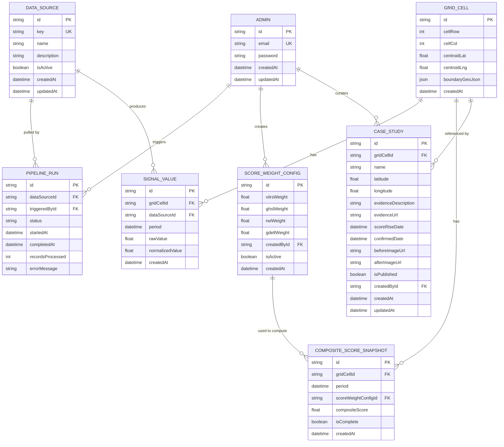

## Project: Shadow Economy Map — Addis Ababa Growth Detection MVP
This becomes `prisma/schema.prisma` (or equivalent ORM schema) almost line for line — write it carefully here first.

**Design decisions carried over from discussion:**
- There are no public user accounts. The map is fully anonymous and public (per FR-01, FR-21, FR-22). The only authenticated role in this schema is **Admin** — a single project/data-team login, no customer accounts, no multi-tier permissions.
- There is no forecasting entity anywhere below. This schema stores only **detected/observed** signals and scores for past and current periods — nothing here predicts a future period. If forecasting is added in a later phase, it is a distinct future-phase ticket (new entity, new methodology, new validation approach), not a small addition to `CompositeScoreSnapshot`.
- Composite score snapshots are never overwritten in place — each period's score is stored as its own row, specifically so the time-slider (FR-02) can show genuine historical change rather than only the latest recomputation.

⚠️ **DESIGN NOTE (flagged for review):** the `ScoreWeightConfig` and `GridCell` shapes below were derived from the Functional Requirements doc (FR-14 through FR-19) and general geospatial-grid conventions, not from a verified technical spec — because none exists yet for this project at time of writing. Everything marked **[DESIGN DECISION — NEEDS CONFIRMATION]** should be reviewed and confirmed (or corrected) by whoever owns the pipeline/scoring implementation before being treated as final, especially the grid resolution and the weight-versioning approach.

---

### 4.1 Entity List

| Entity | Purpose |
|---|---|
| Admin | A project/data-team member with access to the protected admin area |
| DataSource | One of the four external data sources feeding the system (VIIRS, GHSL, Meta RWI, GDELT) |
| PipelineRun | A single attempted data pull/refresh for one data source, logged for observability (FR-14, FR-16, FR-20) |
| GridCell | A single spatial cell in the Addis Ababa grid over which signals and scores are computed |
| SignalValue | A single data source's raw and normalized value for one grid cell in one time period |
| ScoreWeightConfig ⚠️ | A versioned set of per-source weights used to compute the composite score (FR-18) |
| CompositeScoreSnapshot | The computed composite growth score for one grid cell in one time period, tied to the weight config used to produce it |
| CaseStudy | An admin-curated, independently verified known-growth location shown on the public map (FR-06, FR-07, FR-08, FR-19) |

---

### 4.2 Entity Detail

#### Admin

| Field | Type | Constraints | Notes |
|---|---|---|---|
| id | String (UUID) | PK, default uuid() | |
| email | String | unique, required | |
| password | String | required | bcrypt hash, never returned in API responses |
| createdAt | DateTime | default now() | |
| updatedAt | DateTime | updatedAt | |

**Relations:**
- `pipelineRuns`: one Admin → many PipelineRun (`triggeredBy`)
- `scoreWeightConfigs`: one Admin → many ScoreWeightConfig (`createdBy`)
- `caseStudies`: one Admin → many CaseStudy (`createdBy`)

Note: there is intentionally no `role` field — per scope, there is only one admin type in this release (no multi-admin permission tiers, per the Non-Functional Requirements doc).

---

#### DataSource

| Field | Type | Constraints | Notes |
|---|---|---|---|
| id | String (UUID) | PK, default uuid() | |
| key | Enum (DataSourceKey) | unique, required | `VIIRS \| GHSL \| RWI \| GDELT` |
| name | String | required | Display name, e.g. "VIIRS Night-Time Lights" |
| description | String | required | Short explanation shown on the methodology page (FR-09) |
| isActive | Boolean | default true | Allows disabling a source without deleting historical data |
| createdAt | DateTime | default now() | |
| updatedAt | DateTime | updatedAt | |

**Relations:**
- `signalValues`: one DataSource → many SignalValue
- `pipelineRuns`: one DataSource → many PipelineRun

Seed data: this table is expected to contain exactly four rows at launch (VIIRS, GHSL, RWI, GDELT) — it exists as a table rather than a hardcoded enum specifically so new sources can be added later (Grand Vision) without a schema migration.

---

#### PipelineRun

| Field | Type | Constraints | Notes |
|---|---|---|---|
| id | String (UUID) | PK, default uuid() | |
| dataSourceId | String | FK → DataSource.id, required | |
| triggeredById | String | FK → Admin.id, required | |
| status | Enum (RunStatus) | required, default RUNNING | `RUNNING \| SUCCESS \| FAILED` |
| startedAt | DateTime | default now() | |
| completedAt | DateTime? | nullable | Set when the run finishes (success or failure) |
| recordsProcessed | Int? | nullable | Count of grid cells/records successfully ingested, for observability |
| errorMessage | String? | nullable | Populated only on failure |

**Relations:**
- `dataSource`: many PipelineRun → one DataSource
- `triggeredBy`: many PipelineRun → one Admin

Drives FR-15 ("last successful update" timestamp) and FR-16 (health status) — both are derived by querying the most recent `PipelineRun` per `DataSource`, rather than stored redundantly on `DataSource` itself.

---

#### GridCell ⚠️ [DESIGN DECISION — NEEDS CONFIRMATION: exact resolution/size]

| Field | Type | Constraints | Notes |
|---|---|---|---|
| id | String (UUID) | PK, default uuid() | |
| cellRow | Int | required | Row index within the Addis Ababa grid |
| cellCol | Int | required | Column index within the Addis Ababa grid |
| centroidLat | Float | required | Used for map rendering and case-study proximity checks |
| centroidLng | Float | required | |
| boundaryGeoJson | Json | required | Polygon boundary of the cell, used for map rendering |
| createdAt | DateTime | default now() | |

**Relations:**
- `signalValues`: one GridCell → many SignalValue
- `compositeScoreSnapshots`: one GridCell → many CompositeScoreSnapshot
- `caseStudies`: one GridCell → many CaseStudy (nullable link — a case study may reference a specific cell, or just store its own coordinates)

**Constraints:** unique composite on `(cellRow, cellCol)` — one cell per grid position.

Open question for the pipeline owner: what cell size (e.g., 500m, 1km) actually matches the resolution of the coarsest input source (Meta RWI, at ~2.4km) without producing false precision. This directly affects how many `GridCell` rows exist and should be settled before the grid is generated, not after.

---

#### SignalValue

| Field | Type | Constraints | Notes |
|---|---|---|---|
| id | String (UUID) | PK, default uuid() | |
| gridCellId | String | FK → GridCell.id, required | |
| dataSourceId | String | FK → DataSource.id, required | |
| period | DateTime | required | Represents the time period this value applies to (e.g., first day of the month) |
| rawValue | Float | required | The source's original value for this cell/period |
| normalizedValue | Float | required | Value scaled to a common 0–1 (or similar) range for use in the composite score formula |
| createdAt | DateTime | default now() | |

**Relations:**
- `gridCell`: many SignalValue → one GridCell
- `dataSource`: many SignalValue → one DataSource

**Constraints:** unique composite on `(gridCellId, dataSourceId, period)` — one value per cell, per source, per period; a re-pull for the same period updates the existing row rather than duplicating it.

This table is what powers the FR-04 signal-breakdown panel — each cell/period's `SignalValue` rows across all four sources are what's shown to a visitor who clicks a cell.

---

#### ScoreWeightConfig ⚠️ [DESIGN DECISION — NEEDS CONFIRMATION]

| Field | Type | Constraints | Notes |
|---|---|---|---|
| id | String (UUID) | PK, default uuid() | |
| viirsWeight | Float | required | |
| ghslWeight | Float | required | |
| rwiWeight | Float | required | |
| gdeltWeight | Float | required | |
| createdById | String | FK → Admin.id, required | |
| isActive | Boolean | default false | Only one config should be active at a time; used for the current computation |
| createdAt | DateTime | default now() | |

**Relations:**
- `createdBy`: many ScoreWeightConfig → one Admin
- `compositeScoreSnapshots`: one ScoreWeightConfig → many CompositeScoreSnapshot

Weights are versioned (each edit creates a new row rather than mutating an existing one) so that every `CompositeScoreSnapshot` can point back to exactly which weighting produced it — this matters for the Reproducibility non-functional requirement (a reviewer needs to be able to trace a given score back to the exact formula used, not just the current one).

Open question for the pipeline owner: should weights sum to 1.0 (enforced at the application layer, since it's awkward to enforce in the schema itself), and is a simple weighted sum the intended formula, or something more complex (e.g., non-linear combination)? This affects only application logic, not the schema shape, but should be settled before FR-18 is implemented.

---

#### CompositeScoreSnapshot

| Field | Type | Constraints | Notes |
|---|---|---|---|
| id | String (UUID) | PK, default uuid() | |
| gridCellId | String | FK → GridCell.id, required | |
| period | DateTime | required | Same period convention as SignalValue |
| scoreWeightConfigId | String | FK → ScoreWeightConfig.id, required | |
| compositeScore | Float | required | The final computed growth score for this cell/period |
| isComplete | Boolean | default true | False if one or more source signals were missing/incomplete for this cell/period — see UC-09 alternate flow |
| createdAt | DateTime | default now() | |

**Relations:**
- `gridCell`: many CompositeScoreSnapshot → one GridCell
- `scoreWeightConfig`: many CompositeScoreSnapshot → one ScoreWeightConfig

**Constraints:** unique composite on `(gridCellId, period, scoreWeightConfigId)` — recomputing with the same weight config for the same cell/period updates that row; recomputing with a *new* weight config creates a new row, preserving prior results for comparison rather than silently replacing them.

Note: an incomplete snapshot (`isComplete: false`) is still stored, not discarded — the public map is expected to visually distinguish incomplete cells rather than hide them, so visitors aren't misled by a confident-looking score built on partial data.

---

#### CaseStudy

| Field | Type | Constraints | Notes |
|---|---|---|---|
| id | String (UUID) | PK, default uuid() | |
| gridCellId | String? | FK → GridCell.id, nullable | Optional — a case study can reference a specific cell for cross-linking, but stores its own coordinates independently below |
| name | String | required | e.g., "Bole Arabsa growth corridor" |
| latitude | Float | required | |
| longitude | Float | required | |
| evidenceDescription | String | required | Short explanation of the independently verified growth (FR-07) |
| evidenceUrl | String? | nullable | Link to supporting news/report, where available |
| scoreRiseDate | DateTime | required | Date the composite score began rising for this location |
| confirmedDate | DateTime | required | Date the growth was independently confirmed (news/report date) |
| beforeImageUrl | String? | nullable | For the before/after comparison (FR-08) |
| afterImageUrl | String? | nullable | |
| isPublished | Boolean | default false | Admin must explicitly publish before it appears on the public map |
| createdById | String | FK → Admin.id, required | |
| createdAt | DateTime | default now() | |
| updatedAt | DateTime | updatedAt | |

**Relations:**
- `gridCell`: many CaseStudy → one GridCell (nullable)
- `createdBy`: many CaseStudy → one Admin

Why `isPublished` defaults to false: case studies represent a factual claim ("this area's growth was independently verified") and should require a deliberate admin action to go live, rather than appearing automatically on creation/draft.

---

### 4.3 ER Diagram

---

### 4.4 Indexes & Constraints Beyond the Obvious

| Item | Detail |
|---|---|
| GridCell(cellRow, cellCol) | Unique composite — one cell per grid position |
| SignalValue(gridCellId, dataSourceId, period) | Unique composite — one value per cell/source/period; re-pulls update in place |
| SignalValue(period) | Index — the time-slider (FR-02) queries by period across many cells at once |
| CompositeScoreSnapshot(gridCellId, period, scoreWeightConfigId) | Unique composite — see 4.2 note on preserving prior computations under different weight configs |
| CompositeScoreSnapshot(period) | Index — same time-slider access pattern as SignalValue |
| PipelineRun(dataSourceId, startedAt) | Index — supports "most recent run per source" lookups for FR-15/FR-16 without scanning the full table |
| ScoreWeightConfig(isActive) | Partial/filtered index recommended — only one config should be active at a time; enforce "only one active" at the application layer, since a database-level partial-unique constraint depends on the specific database engine |
| CaseStudy(isPublished) | Index — the public map only ever queries published case studies |
| No cascade delete: DataSource → SignalValue | Deliberately not cascading. Deactivating a source (`isActive: false`) should never silently delete historical signal data; use `onDelete: Restrict`, and disable via the `isActive` flag instead |
| No cascade delete: GridCell → CompositeScoreSnapshot | Deliberately not cascading, for the same reason — historical scores must survive even if a grid is later regenerated at a different resolution. In practice, `GridCell` rows are not expected to be deleted once the grid is generated |
| Cascade delete: ScoreWeightConfig → (none) | `CompositeScoreSnapshot` references a `ScoreWeightConfig` but should use `onDelete: Restrict`, not cascade — a weight config should never be deletable once it has snapshots depending on it; deactivate via `isActive` instead |
| Float for signal/score values | `Float` (not `Decimal`) is acceptable here, unlike the money fields in a typical e-commerce schema — these are scientific/statistical values, not currency, so standard floating-point precision is sufficient |
| No currency fields anywhere | This schema has no monetary data at all — the MVP is not a commercial/paid product (per Non-Functional/Out-of-Scope sections in doc 2) |

---

### 4.5 Migration Notes

_(To be filled in as the schema is implemented — record any deviations from this design, and update the corresponding [DESIGN DECISION — NEEDS CONFIRMATION] flags above once resolved, rather than leaving them stale.)_

---

**Next:** proceed to → [5. API Specification]
